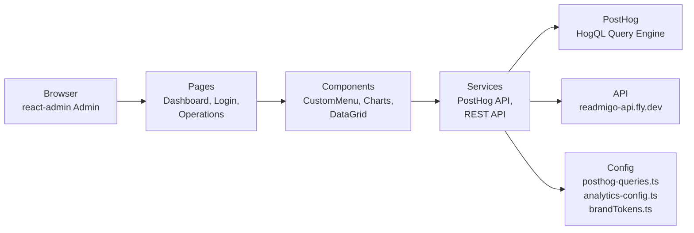

# Readmigo Dashboard — Operations Analytics Backend

A real-time analytics dashboard built with React + Vite. It provides the Readmigo operations team with multi-dimensional visualizations of user behavior, book performance, subscription revenue, and content statistics. Integrates the PostHog HogQL query engine, the MUI component library, and the Recharts charting system.

## Role

The hub for Readmigo product operations. It queries the PostHog data lake and the in-house API in real time for user behavior, reading time, retention funnels, subscription conversion, language distribution, and other key metrics, supporting both day-to-day decisions and long-term growth planning. The backend API is provided by the `api` project.

## Tech Stack

- **Framework**: React 18 + Vite 5
- **Language**: TypeScript
- **UI Components**: Material UI (MUI) 6
- **Forms and Data**: react-admin v5 (enterprise admin framework)
- **Charts**: Recharts
- **Data Fetching**: PostHog HogQL API
- **Internationalization**: ra-i18n-polyglot (EN, ZH-Hans, ZH-Hant)
- **Styling**: MUI sx prop + brand design tokens (brandTokens.ts)
- **Testing**: Playwright

## Architecture



## Directory Structure

```
dashboard/
├── src/
│   ├── app/                     # App wiring
│   │   └── navigation.tsx       # Single source of truth: resources + routes + sidebar (lazy-loaded)
│   ├── components/              # React component library
│   │   ├── CustomMenu.tsx       # Navigation menu (driven by app/navigation)
│   │   ├── CustomAppBar.tsx     # Header navigation bar
│   │   ├── common/              # Common components (cards, forms, etc.)
│   │   └── charts/              # Recharts chart components
│   ├── pages/                   # react-admin pages
│   │   ├── Dashboard.tsx        # Main dashboard
│   │   ├── Login.tsx            # Login page
│   │   ├── Operations.tsx       # Operations analytics page
│   │   ├── Users.tsx            # User management
│   │   ├── Books.tsx            # Book management
│   │   ├── Subscription.tsx     # Subscription management
│   │   └── ...
│   ├── services/                # API service layer
│   │   ├── posthog.ts           # PostHog HogQL client
│   │   ├── api.ts               # REST API client
│   │   └── ...
│   ├── contexts/                # React Context
│   │   ├── TimezoneContext.tsx
│   │   └── ...
│   ├── hooks/                   # Custom hooks
│   │   ├── usePostHogQuery.ts
│   │   └── ...
│   ├── i18n/                    # Internationalization resources
│   │   ├── en.ts
│   │   ├── zh-Hans.ts
│   │   └── zh-Hant.ts
│   ├── config/                  # Application config
│   │   ├── posthog-queries.ts   # 12 categories of HogQL query templates
│   │   ├── analytics-config.ts  # PostHog params, internal user filtering
│   │   └── theme.ts             # MUI theme
│   ├── theme/                   # Design tokens
│   │   ├── brandTokens.ts       # Colors, shadows, radii, spacing
│   │   └── chartColors.ts       # Chart palette
│   ├── App.tsx                  # Root component (react-admin Admin)
│   ├── main.tsx                 # Vite entry
│   └── vite-env.d.ts
├── public/                      # Static assets
├── tests/                       # Playwright E2E tests
├── playwright.config.ts
├── tsconfig.json
└── package.json
```

## Local Development

### Requirements

- Node.js 20.x
- pnpm (recommended) or npm

### Install and Run

```bash
# Clone the project
git clone https://github.com/readmigo/dashboard.git
cd dashboard

# Install dependencies
pnpm install

# Set up environment variables
cp .env.example .env.local

# Start the dev server (http://localhost:5173)
pnpm dev

# Production build
pnpm build

# Preview the production build
pnpm preview

# Run Playwright E2E tests
pnpm test

# Run tests visually in the browser
pnpm test:ui
```

### Common Commands

```bash
pnpm lint    # ESLint check
```

## Deployment

Automated deployment workflow:

- **Trigger**: Code pushed to the main branch
- **Workflow**: `.github/workflows/ci.yml`
- **Target**: GitHub Pages / Vercel
- **URL**: https://dashboard.readmigo.com

**Manual deployment** (if needed):
```bash
pnpm build
# Commit the dist/ directory to GitHub Pages, or connect to Vercel
```

## Environment Variables

### Data Source APIs

- `VITE_POSTHOG_HOST` — PostHog instance URL (default: https://us.i.posthog.com)
- `VITE_POSTHOG_PROJECT_ID` — PostHog project ID (312868)
- `VITE_POSTHOG_API_KEY` — PostHog Personal API Key (requires Dashboard:Write, Insight:Read)
- `VITE_API_URL` — Readmigo API base URL (https://readmigo-api.fly.dev)

### UI Configuration

- `VITE_APP_TITLE` — Application title
- `VITE_TIMEZONE` — Default timezone (UTC+8, etc.)

## Operations Analytics System

### Query Templates (src/config/posthog-queries.ts)

Contains 12 categories of core HogQL queries:

1. **DAU / MAU** — Daily and monthly active users
2. **New User Signups** — By source (Google OAuth, Apple Sign-In)
3. **Reading Behavior** — Reading starts, reading time, page count
4. **Retention** — D1, D7, D30 user retention
5. **Subscription Conversion** — Paywall views, purchase conversion rate
6. **Language Distribution** — Stats by user locale
7. **Platform Distribution** — iOS/Android/Web/Cloudflare marketing site
8. **Error Rates** — Error counts via Sentry integration
9. **Push Open Rate** — Notification clicks and conversion
10. **Book Popularity** — Top 50 reading volume ranking
11. **Revenue Metrics** — MRR, ARPU, Paywall→Purchase conversion
12. **Internal User Filtering** — Excludes 4 test user IDs

### Configuration Parameters (src/config/analytics-config.ts)

```typescript
INTERNAL_USER_IDS = [
  '88952c83-83f1-4bdc-a7a0-85f3c3e4c2ab',  // iOS multi-device
  'a14b013d-fd4c-4f23-91e0-41e0dcf92417',  // Android Pixel 3a
  '7ca8da67-4861-4267-a1b5-be3b357b438d',  // Android OnePlus 8Pro
  '88c99ab9-4f25-52cc-8999-3e58d559ec41',  // iOS iPhone 11 Pro Max
];
LANGUAGE_MAPPING = { en, zh, ja, ko, es, ... };  // ISO 639-1 mapping
DATA_SOURCES = { posthog, amplitude, sentry, checkly, cloudflare, ... };
```

### Brand Tokens (src/theme/brandTokens.ts)

All colors, spacing, and radii must be imported from brandTokens — hardcoded hex values are not allowed:

```typescript
import { brandColors, semanticColors, textColors, chartPalette } from './brandTokens';
```

## Related Repos

- **api** — Backend API providing data endpoints
- **docs** — Online documentation and analytics SOP
- **posthog** — PostHog configuration backup (optional)
- **iOS / Android / Web** — Frontend applications that emit event data

## Documentation

- Online docs: https://docs.readmigo.app
- Operations analytics SOP: https://docs.readmigo.app/05-operations/monitoring/operations-analysis-playbook
- Daily report template: https://docs.readmigo.app/05-operations/monitoring/operations-analysis-template
- Daily report backfill guide: see the daily-report backfill workflow in `MEMORY.md`
