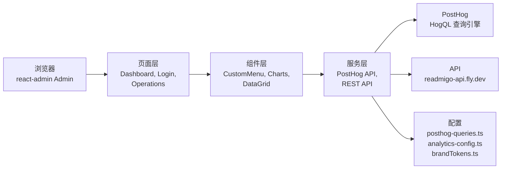

# Readmigo Dashboard — 运营分析后台

React + Vite 构建的实时分析仪表板，为 Readmigo 运营团队提供用户行为、书籍表现、订阅收入、内容统计等多维度可视化数据。集成 PostHog HogQL 查询引擎、MUI 组件库与 Recharts 图表系统。

## 角色定位

Readmigo 产品运营中枢。通过 PostHog 数据湖与自建 API 实时查询用户行为、阅读时长、留存漏斗、订阅转化、语言分布等关键指标，支撑日常决策与长期增长规划。后台 API 由 `api` 项目支撑。

## 技术栈

- **框架**: React 18 + Vite 5
- **语言**: TypeScript
- **UI 组件**: Material UI (MUI) 6
- **表单与数据**: react-admin v5 (企业级管理框架)
- **图表**: Recharts
- **数据获取**: PostHog HogQL API
- **国际化**: ra-i18n-polyglot (EN, ZH-Hans, ZH-Hant)
- **样式**: MUI sx prop + 品牌设计令牌 (brandTokens.ts)
- **测试**: Playwright

## 架构



## 目录结构

```
dashboard/
├── src/
│   ├── components/              # React 组件库
│   │   ├── CustomMenu.tsx       # 导航菜单
│   │   ├── CustomAppBar.tsx     # 头部导航栏
│   │   ├── common/              # 通用组件 (卡片、表单等)
│   │   └── charts/              # Recharts 图表组件
│   ├── pages/                   # react-admin 页面
│   │   ├── Dashboard.tsx        # 主仪表板
│   │   ├── Login.tsx            # 登录页
│   │   ├── Operations.tsx       # 运营分析页
│   │   ├── Users.tsx            # 用户管理
│   │   ├── Books.tsx            # 书籍管理
│   │   ├── Subscription.tsx     # 订阅管理
│   │   └── ...
│   ├── services/                # API 服务层
│   │   ├── posthog.ts           # PostHog HogQL 客户端
│   │   ├── api.ts               # REST API 客户端
│   │   └── ...
│   ├── contexts/                # React Context
│   │   ├── TimezoneContext.tsx
│   │   └── ...
│   ├── hooks/                   # 自定义 hooks
│   │   ├── usePostHogQuery.ts
│   │   └── ...
│   ├── i18n/                    # 国际化资源
│   │   ├── en.ts
│   │   ├── zh-Hans.ts
│   │   └── zh-Hant.ts
│   ├── config/                  # 应用配置
│   │   ├── posthog-queries.ts   # 12 类 HogQL 查询模板
│   │   ├── analytics-config.ts  # PostHog 参数、内部用户过滤
│   │   └── theme.ts             # MUI 主题
│   ├── theme/                   # 设计令牌
│   │   ├── brandTokens.ts       # 颜色、阴影、圆角、间距
│   │   └── chartColors.ts       # 图表调色板
│   ├── App.tsx                  # 根组件 (react-admin Admin)
│   ├── main.tsx                 # Vite 入口
│   └── vite-env.d.ts
├── public/                      # 静态资源
├── tests/                       # Playwright E2E 测试
├── playwright.config.ts
├── tsconfig.json
└── package.json
```

## 本地开发

### 环境要求

- Node.js 20.x
- pnpm (推荐) 或 npm

### 安装与运行

```bash
# 克隆项目
git clone https://github.com/readmigo/dashboard.git
cd dashboard

# 安装依赖
pnpm install

# 设置环境变量
cp .env.example .env.local

# 启动开发服务器 (http://localhost:5173)
pnpm dev

# 生产构建
pnpm build

# 预览生产构建
pnpm preview

# 运行 Playwright E2E 测试
pnpm test

# 在浏览器中可视化运行测试
pnpm test:ui
```

### 常用命令

```bash
pnpm lint    # ESLint 检查
```

## 部署

自动化部署流程：

- **触发条件**: 代码 push 到 main 分支
- **工作流**: `.github/workflows/ci.yml`
- **目标**: GitHub Pages / Vercel
- **URL**: https://dashboard.readmigo.com

**手动部署** (如需):
```bash
pnpm build
# 提交 dist/ 目录到 GitHub Pages，或连接 Vercel
```

## 环境变量

### 数据源 API

- `VITE_POSTHOG_HOST` — PostHog 实例地址 (默认: https://us.i.posthog.com)
- `VITE_POSTHOG_PROJECT_ID` — PostHog 项目 ID (312868)
- `VITE_POSTHOG_API_KEY` — PostHog Personal API Key (需要 Dashboard:Write, Insight:Read)
- `VITE_API_URL` — Readmigo API 基地址 (https://readmigo-api.fly.dev)

### UI 配置

- `VITE_APP_TITLE` — 应用标题
- `VITE_TIMEZONE` — 默认时区 (UTC+8 等)

## 运营数据体系

### 查询模板 (src/config/posthog-queries.ts)

包含 12 类核心 HogQL 查询：

1. **DAU / MAU** — 日活与月活用户
2. **新用户注册** — 按来源 (Google OAuth, Apple Sign-In)
3. **阅读行为** — 开始阅读、阅读时长、页数
4. **留存率** — D1, D7, D30 用户留存
5. **订阅转化** — 看 Paywall 用户数、购买转化率
6. **语言分布** — 按用户 locale 统计
7. **平台分布** — iOS/Android/Web/Cloudflare 官网
8. **错误率** — Sentry 集成错误数
9. **推送打开率** — 通知点击与转化
10. **书籍热度** — 阅读量排名 Top 50
11. **收入指标** — MRR、ARPU、Paywall→Purchase 转化
12. **内部用户过滤** — 排除 4 个测试用户 ID

### 配置参数 (src/config/analytics-config.ts)

```typescript
INTERNAL_USER_IDS = [
  '88952c83-83f1-4bdc-a7a0-85f3c3e4c2ab',  // iOS multi-device
  'a14b013d-fd4c-4f23-91e0-41e0dcf92417',  // Android Pixel 3a
  '7ca8da67-4861-4267-a1b5-be3b357b438d',  // Android OnePlus 8Pro
  '88c99ab9-4f25-52cc-8999-3e58d559ec41',  // iOS iPhone 11 Pro Max
];
LANGUAGE_MAPPING = { en, zh, ja, ko, es, ... };  // ISO 639-1 映射
DATA_SOURCES = { posthog, amplitude, sentry, checkly, cloudflare, ... };
```

### 品牌令牌 (src/theme/brandTokens.ts)

所有颜色、间距、圆角必须从 brandTokens 导入，禁止硬编码 hex 值：

```typescript
import { brandColors, semanticColors, textColors, chartPalette } from './brandTokens';
```

## 相关 Repo

- **api** — 后端 API，提供数据接口
- **docs** — 在线文档与分析 SOP
- **posthog** — PostHog 配置备份（可选）
- **iOS / Android / Web** — 前端应用，生成事件数据

## 文档

- 📚 在线文档: https://docs.readmigo.app
- 运营分析 SOP: https://docs.readmigo.app/05-operations/monitoring/operations-analysis-playbook
- 日报模板: https://docs.readmigo.app/05-operations/monitoring/operations-analysis-template
- 日报补发指南: 见 `MEMORY.md` 中 daily-report 补发流程
