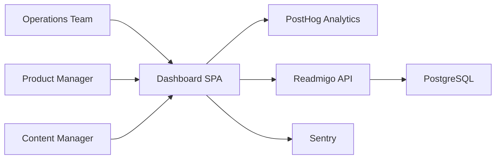
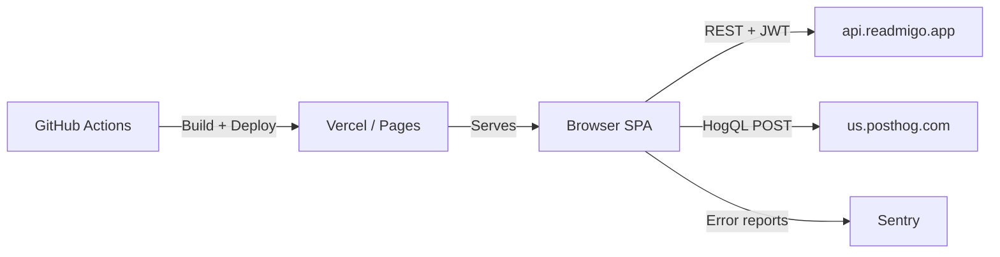

# arc42 §3 — Context & Scope

## Business context

The dashboard serves as the central operations hub for Readmigo. It aggregates data from multiple sources to provide a unified view of platform health, user behavior, and business metrics.

| Actor / System | Direction | Data exchanged |
|---|---|---|
| Operations Team | to Dashboard | Queries, filters, timezone/language preferences |
| Dashboard | to PostHog | HogQL queries (12 categories) |
| PostHog | to Dashboard | Analytics results (DAU, MAU, reading, retention, revenue) |
| Dashboard | to Readmigo API | CRUD requests (14 resources), auth tokens |
| Readmigo API | to Dashboard | JSON responses (books, users, orders, etc.) |
| Dashboard | to Sentry | Error reports via global error boundary |

## Technical context

| Interface | Protocol | Authentication |
|---|---|---|
| Readmigo API | HTTPS REST | Bearer JWT token + X-Admin-Mode header |
| PostHog HogQL | HTTPS POST | Personal API Key (VITE_POSTHOG_PERSONAL_API_KEY) |
| Sentry | HTTPS | DSN key (embedded) |
| GitHub Actions | Git push trigger | GitHub token (automatic) |

## External interfaces

### PostHog HogQL API

- Host: `https://us.posthog.com`
- Project ID: 312868
- Endpoint: `POST /api/projects/{projectId}/query/`
- 11 pre-configured dashboards (audiobookHealth, coreMetrics, subscriptionRevenue, readingAnalytics, featureAdoption, onboardingFunnel, community, bookRankings, platformComparison, thoughtsAnalytics, highlightAnalytics)

### Readmigo REST API

- Host: `https://api.readmigo.app` (production) / `http://localhost:3000` (local)
- 14 resources: books, authors, booklists, categories, users, quotes, messages, guest-feedback, import/batches, tickets, feedback, orders, push notifications, SE import
- Headers: Authorization, X-Admin-Mode, X-Content-Filter

Related: [05-building-blocks.md](./05-building-blocks.md), [04-solution-strategy.md](./04-solution-strategy.md)
