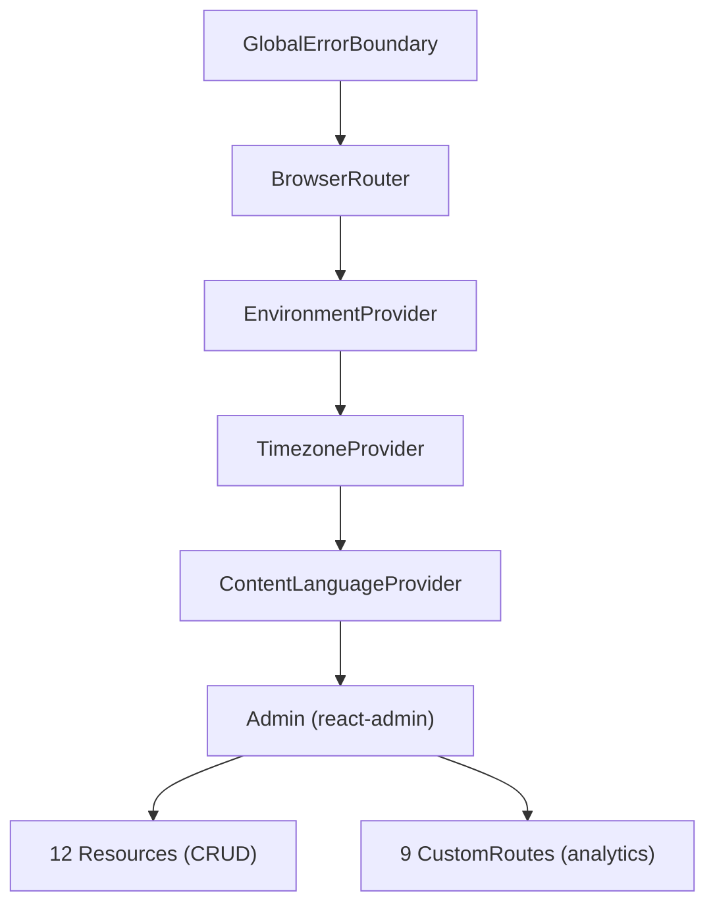

# arc42 §4 — Solution Strategy

## Technical decisions

| Decision | Choice | Alternative considered | Rationale |
|---|---|---|---|
| Admin framework | react-admin v5 | Custom React + React Router | Built-in CRUD, data provider abstraction, i18n, auth integration |
| Analytics engine | PostHog HogQL | Pre-built PostHog dashboards, Metabase | Full SQL flexibility, same data source as production events |
| UI component library | MUI v6 | Ant Design, Chakra UI | react-admin natively integrates with MUI; design token support |
| State management | React Context API (3 active contexts) | Redux, Zustand | Sufficient for dashboard-level state; avoids extra dependency |
| Chart library | Recharts | Chart.js, D3 | Declarative React components, simple integration with MUI |
| Build tool | Vite 5 | Webpack, Turbopack | Fast HMR, native ES modules, simple config |
| Styling approach | MUI sx prop + brandTokens.ts | CSS Modules, Tailwind, styled-components | Consistent with MUI theming; tokens enforce brand consistency |

## Architectural patterns

### 1. Provider tree

The component tree nesting order in `src/App.tsx` (lines 48–161):



| Provider | Source | localStorage key | Custom event |
|---|---|---|---|
| EnvironmentProvider | `src/contexts/EnvironmentContext.tsx` | `dashboard_environment` | `environment-changed` |
| TimezoneProvider | `src/contexts/TimezoneContext.tsx` | `dashboard_timezone` | `timezone-changed` |
| ContentLanguageProvider | `src/contexts/ContentLanguageContext.tsx` | `contentLanguage` | `content-language-changed` |

> **Note:** A 4th context `ContentContext` (`src/contexts/ContentContext.tsx`) exists but is **not mounted** in the provider tree. `ContentFilterSelector` references it; this is tech debt to consolidate with `ContentLanguageContext`. See [08-tech-debt-risks.md](./08-tech-debt-risks.md) TD-2.

### 2. Design token system

Token flow from source-of-truth to rendered components:

```mermaid
graph LR
    BT["brandTokens.ts"] -->|colors, gradients,<br/>shadows, radii| TH["theme.ts"]
    TH -->|createTheme()| MUI["MUI Components"]
    BT -->|chartPalette<br/>re-export| CC["chartColors.ts"]
    CC -->|palette, gridStroke,<br/>tooltipStyle| RC["Recharts Charts"]
    BT -->|direct import| SX["sx prop in pages"]
```

| Layer | File | Exports |
|---|---|---|
| **Source tokens** | `src/theme/brandTokens.ts` | `brandColors`, `semanticColors`, `textColors`, `bgColors`, `grays`, `gradients`, `shadows`, `radii`, `chartPalette`, `alpha()` |
| **MUI theme** | `src/theme.ts` | `readmigoTheme` (palette, typography, shape, shadows, component overrides — all derived from brandTokens) |
| **Chart helpers** | `src/theme/chartColors.ts` | Re-exports `chartPalette`, `brandColors`, `semanticColors` from brandTokens; adds `gridStroke`, `tooltipStyle` |

### 3. Dual data source

CRUD and analytics data flow through separate paths, converging in the same UI:

```mermaid
graph LR
    subgraph CRUD
        RA["react-admin"] -->|DataProvider| DP["dataProvider.ts"]
        DP -->|REST + JWT| API["api.readmigo.app"]
    end
    subgraph Analytics
        AP["Analytics Pages"] -->|fetch + API Key| PH["PostHog HogQL"]
    end
    DP -->|getStoredEnvironment()| ENV["EnvironmentContext"]
    DP -->|getStoredContentLanguage()| CL["ContentLanguageContext"]
    API -->|JSON| RA
    PH -->|JSON| AP
```

| Path | Data source | Auth | Headers |
|---|---|---|---|
| CRUD | Readmigo REST API | Bearer JWT (sessionStorage) | `Authorization`, `X-Admin-Mode: true`, `X-Content-Filter` |
| Analytics | PostHog HogQL API | Personal API Key (env var) | `Authorization: Bearer {VITE_POSTHOG_PERSONAL_API_KEY}` |

### 4. Other patterns

| Pattern | Application |
|---|---|
| **Data provider abstraction** | react-admin DataProvider decouples pages from API; supports multiple response shapes (`items`, `tickets`, `feedbacks`, `orders`, `data`) |
| **Environment switching** | Runtime local/production toggle; `dataProvider.ts` calls `getStoredEnvironment()` on every request |
| **Global error boundary** | React ErrorBoundary at root catches render errors; `src/main.tsx` installs `onerror`, `onunhandledrejection`, `console.error` override into a 200-entry ring buffer |

## Quality-attribute strategies

| Quality | Strategy | Verification |
|---|---|---|
| **Data accuracy** | Internal user filtering (4 test account IDs in `analytics-config.ts`), PostHog HogQL direct queries | Compare dashboard numbers against PostHog UI |
| **Responsiveness** | Vite HMR in dev; static build with tree shaking in prod; all page imports are static (no lazy loading) | Page load < 3s (p95) |
| **Reliability** | GlobalErrorBoundary + debug ring buffer; DataProvider logs all requests/responses | Sentry error rate monitoring |
| **Maintainability** | Design tokens centralize styling; react-admin conventions for CRUD; TypeScript strict mode | `tsc` in CI pipeline |
| **Usability** | 6 timezone options, content language filter (en/zh/all), 4-locale UI (EN, ZH-Hans, ZH-Hant, DE) | Manual verification per locale |

Related: [01-introduction-goals.md](./01-introduction-goals.md), [05-building-blocks.md](./05-building-blocks.md)
