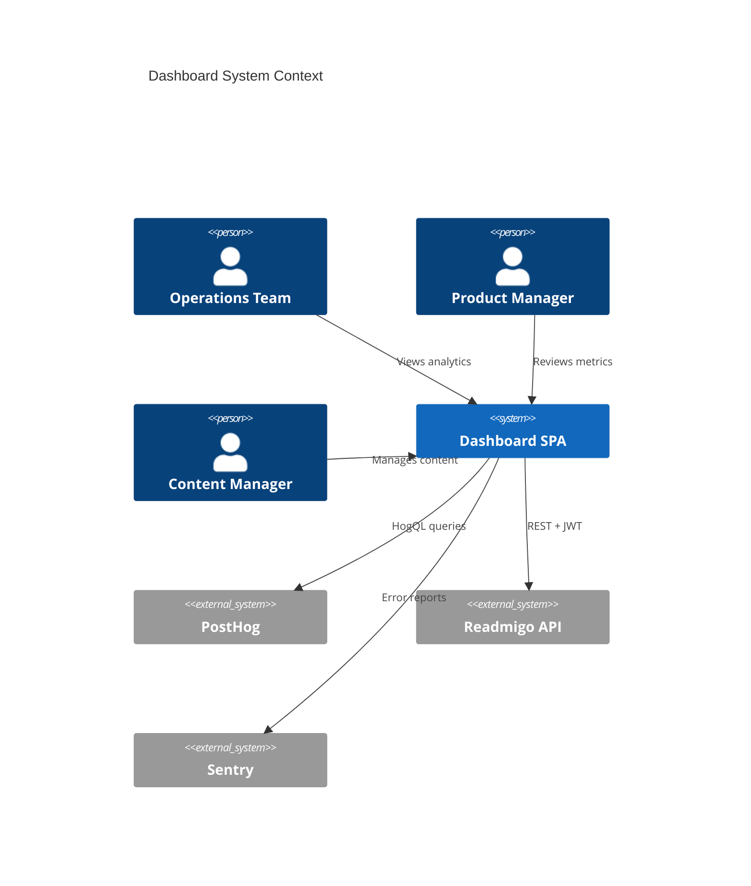
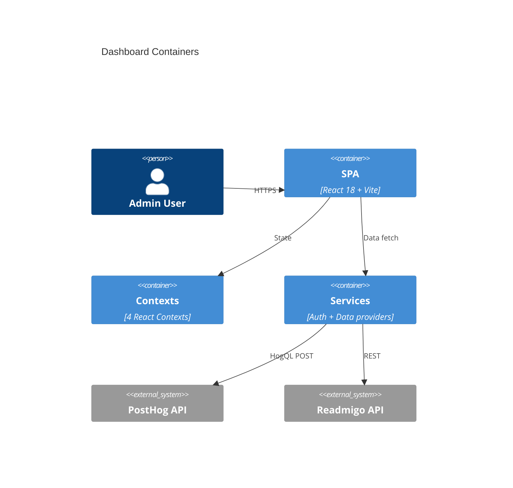

# arc42 §5 — Building Block View (C4)

This section must include at least one [Mermaid C4](https://mermaid.js.org/syntax/c4.html) diagram.

## Level 1: System Context

## Level 2: Container View

## Level 3: Key Building Blocks

| Block | Location | Responsibility |
|---|---|---|
| **App root** | `src/App.tsx` | react-admin Admin component, resource registration, custom routes |
| **Auth provider** | `src/services/authProvider.ts` | JWT login, dev mock mode, session management |
| **Data provider** | `src/services/dataProvider.ts` | REST API client, dynamic env switching, content language headers |
| **PostHog queries** | `src/config/posthog-queries.ts` | 12 categories of HogQL query templates |
| **Analytics config** | `src/config/analytics-config.ts` | Internal user IDs, locale mapping, data sources |
| **Cost config** | `src/config/costConfig.ts` | 13 services, 6 categories, $400/mo budget |
| **Environment config** | `src/config/environments.ts` | Local/production URL definitions |
| **Brand tokens** | `src/theme/brandTokens.ts` | Colors, gradients, shadows, radii, chart palette |
| **MUI theme** | `src/theme.ts` | MUI theme config consuming brand tokens |
| **Chart colors** | `src/theme/chartColors.ts` | Recharts palette derived from brand tokens |
| **4 Contexts** | `src/contexts/` | Environment, Timezone, ContentLanguage, Content |
| **i18n** | `src/i18n/` | 4 locales (EN, ZH-Hans, ZH-Hant, DE) via ra-i18n-polyglot |
| **Pages** | `src/pages/` | 25+ feature areas (CRUD + analytics + tools) |
| **Components** | `src/components/` | Layout, common (StatCard, TrendChart), selectors |
| **Debug system** | `src/main.tsx` | Global error handlers, debug log ring buffer (200 entries) |

Related: [03-context-scope.md](./03-context-scope.md), [06-runtime-view.md](./06-runtime-view.md)
