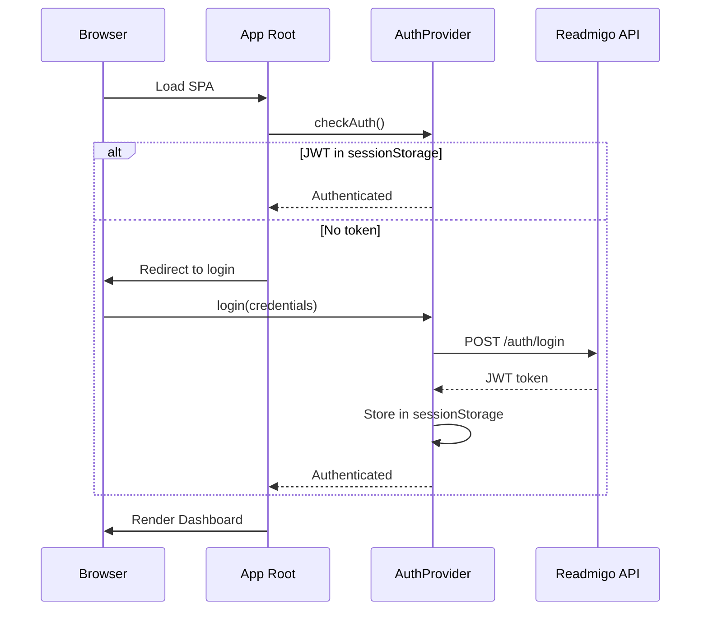
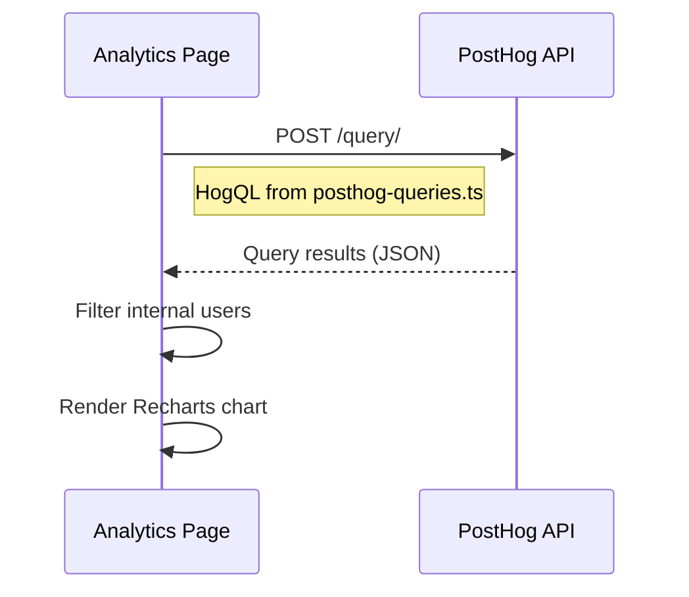
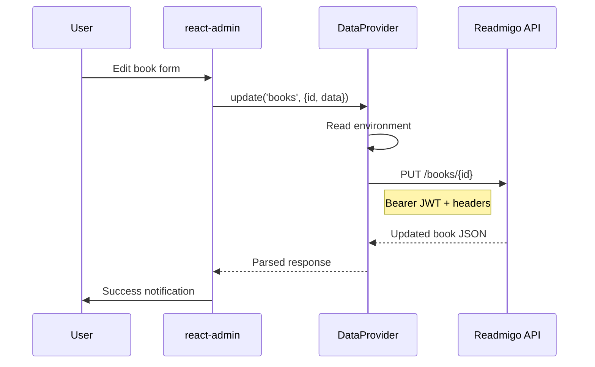
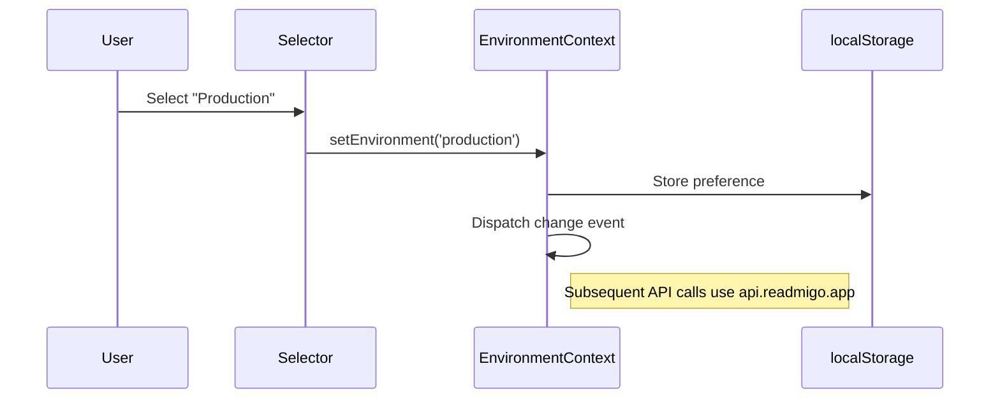

# arc42 §6 — Runtime View

## Key scenarios

### 1. Page load and authentication

### 2. Analytics query via PostHog

### 3. CRUD operation

### 4. Environment switching

## Error recovery paths

| Failure | Detection | Recovery |
|---|---|---|
| React component crash | GlobalErrorBoundary | Renders fallback UI with error details; logs to debug buffer |
| API request failure | DataProvider catch | Logs to `window.__DEBUG_LOG__`, shows react-admin error notification |
| PostHog query timeout | Fetch timeout | Page shows loading state; user can retry manually |
| Auth token expired | 401 response | AuthProvider redirects to login page, clears sessionStorage |
| Unhandled rejection | `onunhandledrejection` | Captured in debug ring buffer (200 entries max) |

Related: [05-building-blocks.md](./05-building-blocks.md), [07-cross-cutting.md](./07-cross-cutting.md)
